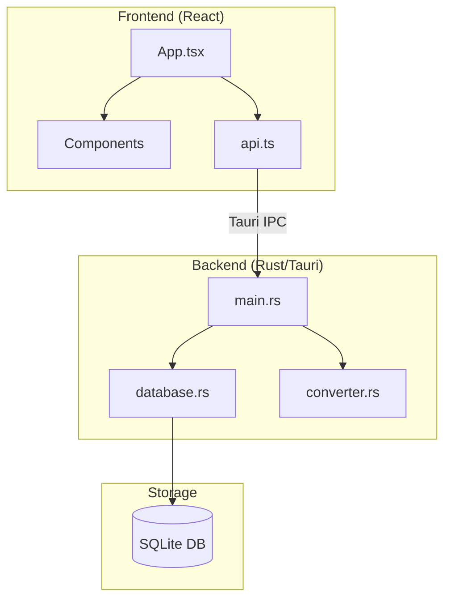
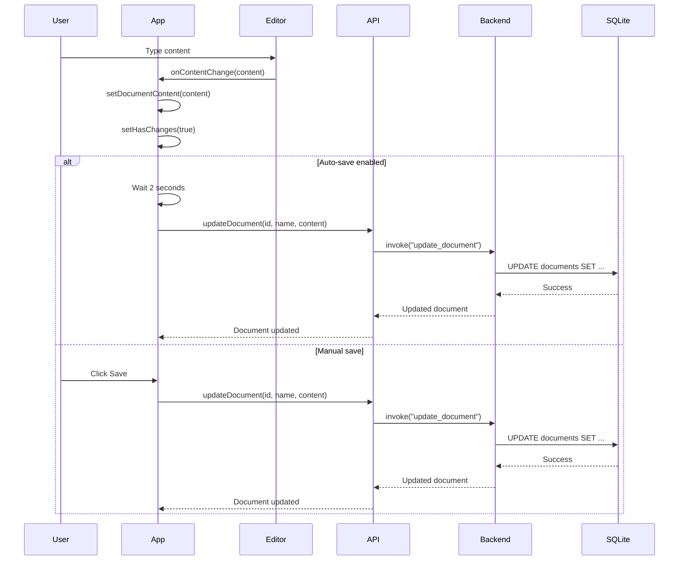
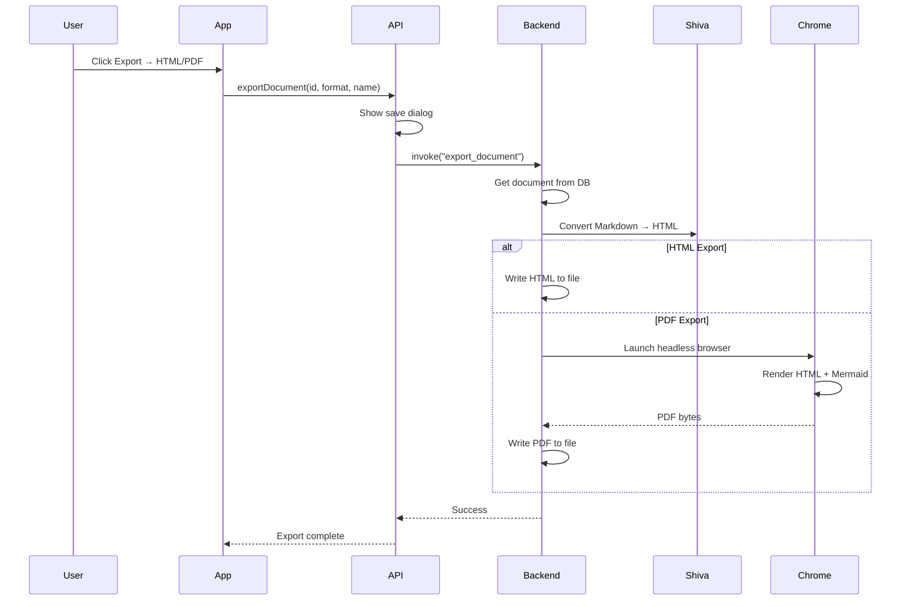

# MarkdownUI Architecture

This document provides a comprehensive overview of the MarkdownUI application architecture, covering both the frontend (React/TypeScript) and backend (Rust/Tauri) components.

## Overview

MarkdownUI is a desktop application built with [Tauri](https://tauri.app/), combining a React frontend with a Rust backend. The application provides a full-featured markdown editor with live preview, Mermaid diagram support, and export capabilities.



---

## Frontend Architecture

The frontend is built with React 18, TypeScript, and styled with TailwindCSS.

### Entry Point

- [main.tsx](../src/main.tsx) - Application bootstrap, renders `App` within `ThemeProvider`
- [ThemeContext.tsx](../src/ThemeContext.tsx) - Theme state management (dark/light mode)

### Main Application Component

#### [App.tsx](../src/App.tsx)

The root component that manages:

- **Application Layout**: Unified header with hamburger menu, document controls, and sidebar
- **State Management**: Collections, documents, and editor state
- **CRUD Operations**: Delegates to [api.ts](../src/api.ts) for backend communication

**Key State:**

```typescript
// Collection/Document selection
const [selectedCollection, setSelectedCollection] = useState<Collection | null>(null);
const [selectedDocument, setSelectedDocument] = useState<Document | null>(null);

// Editor state (lifted from DocumentEditor for unified header)
const [documentName, setDocumentName] = useState("");
const [documentContent, setDocumentContent] = useState("");
const [hasChanges, setHasChanges] = useState(false);
const [autoSaveEnabled, setAutoSaveEnabled] = useState(false);
const [zoomLevel, setZoomLevel] = useState(1.0);
```

**Layout Structure:**

```
┌─────────────────────────────────────────────────────────────────────────┐
│ [☰] Document Name Input        [Auto-save] [Save] │ Zoom │ Export      │
├──────────────────┬──────────────────────────────────────────────────────┤
│ CollectionsBrowser│            DocumentEditor                           │
│  (collapsible)   │    ┌─────────────────┬─────────────────┐            │
│                  │    │     Editor      │    Preview      │            │
│                  │    │   (Monaco)      │  (Markdown)     │            │
│                  │    └─────────────────┴─────────────────┘            │
└──────────────────┴──────────────────────────────────────────────────────┘
```

---

### Components

#### [CollectionsBrowser.tsx](../src/components/CollectionsBrowser.tsx)

Sidebar component for managing collections and documents.

**Features:**
- List and select collections
- Create/delete collections
- List documents within selected collection
- Create/delete/upload documents
- Confirmation modals for destructive actions

**Props:**

```typescript
interface CollectionsBrowserProps {
    collections: Collection[];
    selectedCollection: Collection | null;
    onCollectionSelect: (collection: Collection) => void;
    onCollectionCreate: (name: string, description?: string) => Promise<Collection>;
    onCollectionDelete: (id: number) => Promise<void>;
    selectedDocument: Document | null;
    onDocumentSelect: (document: Document) => void;
    onDocumentCreate: (collectionId: number, name: string, content: string) => Promise<Document>;
    onDocumentDelete: (id: number) => Promise<void>;
}
```

---

#### [DocumentEditor.tsx](../src/components/DocumentEditor.tsx)

Main editor container with side-by-side editor and preview panes.

**Features:**
- Monaco editor for markdown editing
- Custom "midnight-blue" theme for dark mode
- Resizable split between editor and preview

**Props:**

```typescript
interface DocumentEditorProps {
    content: string;
    onContentChange: (content: string) => void;
    zoomLevel: number;
}
```

---

#### [DocumentPreview.tsx](../src/components/DocumentPreview.tsx)

Live markdown preview with Mermaid diagram support.

**Features:**
- GitHub Flavored Markdown (tables, task lists, strikethrough)
- Syntax highlighting via `react-syntax-highlighter` (Prism)
- Mermaid diagram rendering with theme support
- Drag-to-scroll navigation
- Zoom support with transform scaling

**Dependencies:**
- `react-markdown` - Markdown parsing
- `remark-gfm` - GitHub Flavored Markdown
- `rehype-raw` - HTML passthrough
- `mermaid` - Diagram rendering
- `react-syntax-highlighter` - Code block highlighting

---

#### [ResizableSplit.tsx](../src/components/ResizableSplit.tsx)

Resizable split pane component with collapse functionality.

**Features:**
- Draggable divider for resizing
- Collapse/expand buttons for each pane
- Minimum width constraints
- Smooth animations

---

#### [ZoomControls.tsx](../src/components/ZoomControls.tsx)

Zoom level and export controls.

**Features:**
- Zoom in/out/reset buttons
- Zoom level display (percentage)
- Export dropdown menu (Markdown, HTML, PDF)

---

#### [ThemeToggle.tsx](../src/components/ThemeToggle.tsx)

Dark/light mode toggle button with sun/moon icons.

---

#### [ConfirmModal.tsx](../src/components/ConfirmModal.tsx)

Reusable confirmation dialog for destructive actions.

---

### API Layer

#### [api.ts](../src/api.ts)

TypeScript API layer that communicates with the Rust backend via Tauri IPC.

**Data Types:**

```typescript
export interface Collection {
    id: number;
    name: string;
    description: string | null;
    created_at: string;
    updated_at: string;
}

export interface Document {
    id: number;
    collection_id: number;
    name: string;
    content: string;
    created_at: string;
    updated_at: string;
}

export type ExportFormat = "html" | "pdf";
```

**API Functions:**

| Function | Description |
|----------|-------------|
| `getCollections()` | Fetch all collections |
| `createCollection(name, description?)` | Create a new collection |
| `deleteCollection(id)` | Delete a collection |
| `getDocumentsByCollection(collectionId)` | Get documents in a collection |
| `createDocument(collectionId, name, content)` | Create a new document |
| `updateDocument(id, name, content)` | Update a document |
| `deleteDocument(id)` | Delete a document |
| `exportMarkdown(content, filename)` | Export as .md file |
| `exportDocument(documentId, format, filename)` | Export as HTML/PDF |
| `checkPdfAvailable()` | Check if Chrome is installed for PDF export |

---

## Backend Architecture

The backend is built with Rust and Tauri, providing a native desktop experience with SQLite storage.

### Entry Point

#### [main.rs](../src-tauri/src/main.rs)

Tauri application setup and command handlers.

**Initialization:**

```rust
fn main() {
    tauri::Builder::default()
        .setup(|app| {
            // Get app data directory for SQLite storage
            let app_data_dir = app_data_dir(&app.config())?;
            
            // Initialize database
            let database = Database::new(app_data_dir)?;
            app.manage(Mutex::new(database));
            Ok(())
        })
        .invoke_handler(tauri::generate_handler![
            // Collection commands
            get_collections, get_collection, create_collection,
            update_collection, delete_collection,
            // Document commands
            get_documents_by_collection, get_document, create_document,
            update_document, delete_document,
            // Export commands
            check_pdf_available, export_document,
        ])
        .run(tauri::generate_context!())
}
```

**Tauri Commands:**

| Command | Description |
|---------|-------------|
| `get_collections` | Fetch all collections |
| `create_collection` | Create a new collection |
| `delete_collection` | Delete a collection (cascades to documents) |
| `get_documents_by_collection` | Get documents in a collection |
| `create_document` | Create a new document |
| `update_document` | Update document name and content |
| `delete_document` | Delete a document |
| `check_pdf_available` | Check if Chrome is installed |
| `export_document` | Export to HTML or PDF |

---

### Database Layer

#### [database.rs](../src-tauri/src/database.rs)

SQLite database operations using `rusqlite`.

**Schema:**

```sql
CREATE TABLE collections (
    id INTEGER PRIMARY KEY AUTOINCREMENT,
    name TEXT NOT NULL,
    description TEXT,
    created_at TEXT NOT NULL DEFAULT (datetime('now')),
    updated_at TEXT NOT NULL DEFAULT (datetime('now'))
);

CREATE TABLE documents (
    id INTEGER PRIMARY KEY AUTOINCREMENT,
    collection_id INTEGER NOT NULL,
    name TEXT NOT NULL,
    content TEXT NOT NULL DEFAULT '',
    created_at TEXT NOT NULL DEFAULT (datetime('now')),
    updated_at TEXT NOT NULL DEFAULT (datetime('now')),
    FOREIGN KEY (collection_id) REFERENCES collections(id) ON DELETE CASCADE
);
```

**Data Structures:**

```rust
#[derive(Debug, Serialize, Deserialize)]
pub struct Collection {
    pub id: i64,
    pub name: String,
    pub description: Option<String>,
    pub created_at: String,
    pub updated_at: String,
}

#[derive(Debug, Serialize, Deserialize)]
pub struct Document {
    pub id: i64,
    pub collection_id: i64,
    pub name: String,
    pub content: String,
    pub created_at: String,
    pub updated_at: String,
}
```

**Database Location:**

The SQLite database is stored in the application data directory:
- **Windows**: `%APPDATA%\com.markdownui.app\markdownui.db`
- **macOS**: `~/Library/Application Support/com.markdownui.app/markdownui.db`
- **Linux**: `~/.local/share/com.markdownui.app/markdownui.db`

---

### Document Conversion

#### [converter.rs](../src-tauri/src/converter.rs)

Markdown to HTML/PDF conversion using the Shiva library.

**Supported Formats:**

```rust
pub enum ExportFormat {
    Html,
    Pdf,
}
```

**HTML Export:**

1. Extract Mermaid blocks and replace with placeholders
2. Convert Markdown to HTML using Shiva
3. Wrap in styled HTML template with:
   - Modern GitHub-style CSS
   - Light/dark mode support
   - Mermaid.js CDN integration
4. Restore Mermaid blocks as `<pre class="mermaid">` elements

**PDF Export:**

1. Convert to HTML (as above)
2. Use `chromiumoxide` to launch headless Chrome
3. Render HTML and print to PDF
4. Includes 1-second delay for Mermaid diagram rendering

**Requirements for PDF Export:**
- Chrome, Chromium, or Edge must be installed
- Uses "new headless mode" to prevent window flash on Windows

---

## Data Flow

### Document Editing Flow



### Export Flow



---

## Technology Stack

### Frontend

| Technology | Purpose |
|------------|---------|
| React 18 | UI framework |
| TypeScript | Type safety |
| Vite | Build tool |
| TailwindCSS | Styling |
| Monaco Editor | Markdown editor |
| react-markdown | Markdown rendering |
| remark-gfm | GitHub Flavored Markdown |
| react-syntax-highlighter | Code block highlighting |
| Mermaid.js | Diagram rendering |

### Backend

| Technology | Purpose |
|------------|---------|
| Tauri 1.5 | Desktop framework |
| Rust | Backend language |
| rusqlite | SQLite bindings |
| Shiva | Markdown → HTML conversion |
| chromiumoxide | PDF generation |
| serde | Serialization |

---

## File Structure

```
MarkdownUI/
├── src/                          # Frontend source
│   ├── main.tsx                  # React entry point
│   ├── App.tsx                   # Main application component
│   ├── api.ts                    # Tauri IPC API layer
│   ├── ThemeContext.tsx          # Theme state management
│   ├── index.css                 # Global styles + Tailwind
│   └── components/
│       ├── CollectionsBrowser.tsx # Sidebar navigation
│       ├── DocumentEditor.tsx     # Editor container
│       ├── DocumentPreview.tsx    # Markdown preview
│       ├── ResizableSplit.tsx     # Resizable panes
│       ├── ZoomControls.tsx       # Zoom + export controls
│       ├── ThemeToggle.tsx        # Dark/light toggle
│       └── ConfirmModal.tsx       # Confirmation dialog
│
├── src-tauri/                    # Backend source
│   ├── src/
│   │   ├── main.rs               # Tauri commands + setup
│   │   ├── database.rs           # SQLite operations
│   │   └── converter.rs          # Export conversion
│   ├── Cargo.toml                # Rust dependencies
│   └── tauri.conf.json           # Tauri configuration
│
├── docs/                         # Documentation
│   └── ARCHITECTURE.md           # This file
│
└── README.md                     # Project overview
```

---

## Configuration

### Tauri Configuration

See [tauri.conf.json](../src-tauri/tauri.conf.json) for:
- Window size and title
- File system permissions
- Dialog permissions
- App identifier and version

### Theme Persistence

Theme preference is stored in `localStorage`:
- Key: `markdown-ui-theme`
- Values: `"light"` | `"dark"`

### Auto-save Preference

Auto-save preference is stored in `localStorage`:
- Key: `markdown-ui-auto-save`
- Values: `"true"` | `"false"`
