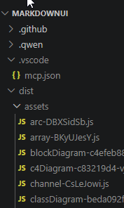

# Plan

I want to change the way the left nav works. I want the collection name to be
like a folder in the left nav. It should work in the same way as
the attached screenshot. I should be able to collapse the collection name
and see the items inside it. See the attached screenshot of the VSCode menu
for reference. The left nav should be similar to the VSCode menu, where the collection name is like a folder that can be expanded or collapsed to show the items inside it. This will help to organize the left nav and make it easier to navigate through the collections and their items.

I want to be able to click a markdown file in the left nav and have it open in the main content area as it does now. The markdown document in the left nav should be expandable and should allow navigation into the headers and subheaders of the document and should serve as a table of contents for the document. This will make it easier to navigate through the markdown document and find the relevant sections quickly.

