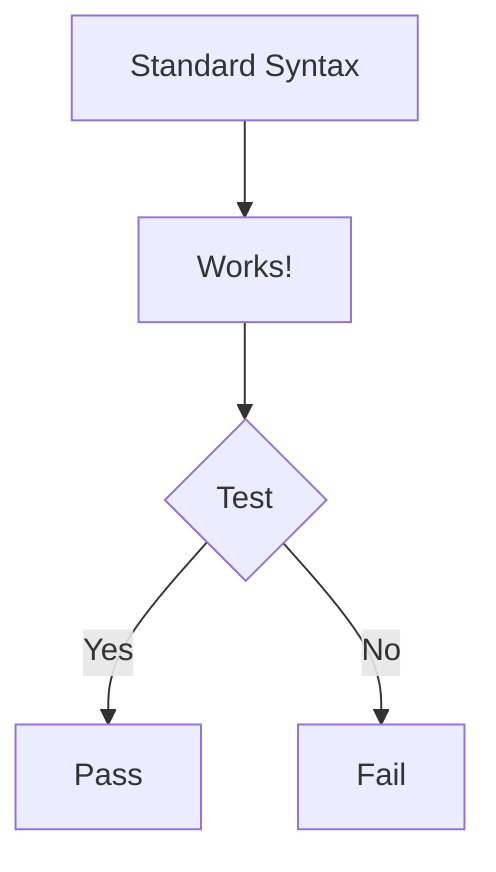
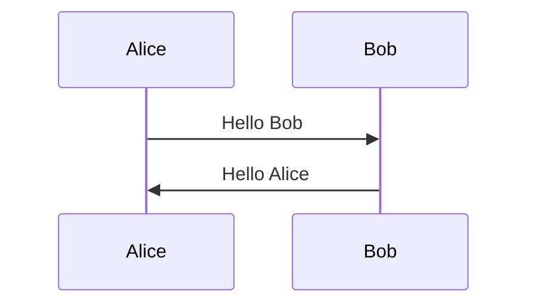
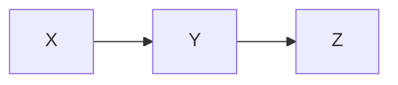

# Mermaid Syntax Test

This document tests both standard and Azure DevOps style mermaid syntax.

## Standard Syntax (```mermaid)



## Azure DevOps Syntax (:::mermaid)

:::mermaid
graph TD
    A[Azure DevOps Syntax] --> B[Also Works!]
    B --> C{Test}
    C -->|Yes| D[Pass]
    C -->|No| E[Fail]
:::

## Multiple Diagrams

### First Diagram (Standard)



### Second Diagram (Azure DevOps)

:::mermaid
sequenceDiagram
    participant Charlie
    participant Diana
    Charlie->>Diana: Hello Diana
    Diana->>Charlie: Hello Charlie
:::

### Third Diagram (Standard)



## Conclusion

Both syntaxes should render correctly!
